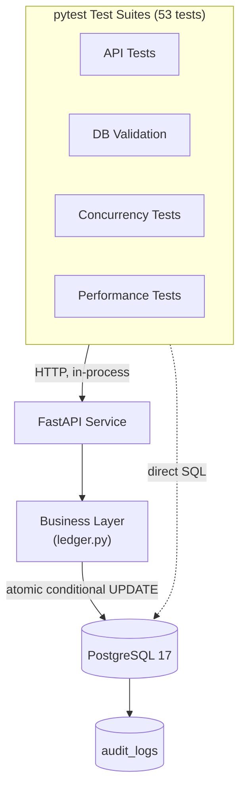

# BankGuard


---

## Overview


BankGuard is an automated database validation platform built around a simulated retail banking environment.

The project automates the verification of deposits, withdrawals, and transfers by continuously validating that every operation preserves data integrity across the API and PostgreSQL database.

Instead of manually inspecting database records after each operation, BankGuard executes automated validation suites that verify transaction integrity, money conservation, audit logging, referential integrity, reconciliation, concurrency, and database performance.

The banking system serves as the **System Under Test (SUT)**, while the primary focus of the project is the automation framework responsible for validating its behavior.

---

## Business Scenario

The Business Problem: Financial systems process thousands of deposits, withdrawals, and transfers every day. As transaction volume grows, manually verifying transaction integrity, account balances, audit logs, and database consistency becomes impractical, increasing the risk of undetected defects.

The Solution: Engineered an automated database validation platform that simulates a production-inspired banking environment and continuously validates transaction integrity, money conservation, balance reconciliation, audit logs, API-to-database consistency, concurrency, and database performance using PostgreSQL, FastAPI, Python, and pytest.

The Business Impact: Reduced the effort required for repetitive database verification, shortened regression testing cycles, and increased confidence in transaction integrity and database consistency before deployment.

---

## Key Highlights

| Highlight | Details |
|-----------|---------|
| **Automated Validation** | **53 automated tests** across 10 validation suites — money conservation, ACID rollback, referential integrity, audit completeness, and more — all deterministic and independent |
| **Concurrency Testing** | **Genuine concurrency testing**: 10+ simultaneous requests fired via real `asyncio.gather()` against actual separate database connections, proving the atomic conditional-UPDATE pattern holds under real race conditions — not just sequential simulation |
| **Large-Scale Data** | **1.25M+ transaction rows, 1.55M+ audit log rows** in the largest seed profile, generated deterministically in under 3 minutes via PostgreSQL's `COPY` protocol |
| **SQL Implementation** | **Zero ORM** — 100% raw, hand-written SQL, with every constraint and index explicitly justified against a specific validation requirement |
| **Performance Validation** | **Query plan validation, not timing assertions** — `EXPLAIN (FORMAT JSON)` confirms indexed lookups stay indexed at scale; a ~300x cost difference measured between an indexed and unindexed lookup on the same 100K-row table |
| **CI/CD** | **Tiered CI/CD** (smoke/regression/performance) with Docker, Trivy vulnerability scanning, and Dependabot — smoke tests run in ~2 seconds on every push |
| **Database Safety** | **Concurrency-safe by design**: atomic conditional `UPDATE` statements and deadlock-avoidant lock ordering, verified rather than assumed |

---

## Documentation

- [Architecture & Design Decisions](docs/architecture.md)
- [Database Schema](docs/database_schema.md)
- [API Reference](docs/api.md)
- [Testing Strategy](docs/testing_strategy.md)
- [CI/CD Pipeline](docs/cicd.md)
- [Installation Guide](docs/installation.md)

---

## Project Structure

```
BankGuard/
├── main.py                 # FastAPI app, 5 endpoints
├── database.py              # Connection pool
├── ledger.py                 # Core business logic (deposit/withdraw/transfer)
├── schemas.py                 # Pydantic request/response models
├── exceptions.py               # Custom exceptions → HTTP status mapping
├── migrations/                  # Versioned raw SQL migrations
├── scripts/
│   ├── run_migrations.py         # Migration runner
│   ├── seed_data.py                # Deterministic dataset generator (3 profiles)
│   ├── seed/                        # Generators, ledger simulation, config
│   └── performance_report.py         # EXPLAIN ANALYZE report generator
├── tests/                              # 53 tests across 10 suites
├── docker-compose.yml
├── Dockerfile
└── .github/workflows/                    # smoke / regression / performance pipelines
```

---

## Architecture



Full diagrams (ER schema, transfer sequence flow, test isolation strategy, CI/CD pipeline) are in [docs/architecture.md](docs/architecture.md).

## What's actually being validated

| Suite | Proves |
|---|---|
| Money Conservation | Transfers never create or destroy money |
| ACID Rollback | Failed operations leave zero partial state |
| Duplicate Transaction Prevention | Idempotency-Key replay never double-processes — even under real concurrency |
| Balance Reconciliation | Every account's balance always matches its own audit trail |
| Referential Integrity | The database itself rejects orphaned foreign keys |
| Constraint Validation | Invalid data (negative balances, self-transfers, bad enum values) is rejected at the DB level |
| Audit Log Completeness | Every transaction generates exactly 1 audit row; every transfer, exactly 2 |
| API-to-DB Consistency | API responses always match actual database state, on both success and failure |
| Concurrency Safety | 10+ simultaneous requests against the same account never corrupt balances or deadlock |
| Query Plan Validation | Indexed lookups stay indexed on a 1.25M+ row table — verified via `EXPLAIN`, never via timing |

---

## Tech Stack

| Layer | Choice |
|---|---|
| Language | Python 3.13 |
| Database | PostgreSQL 17 — raw SQL only, no ORM |
| API | FastAPI + psycopg 3 (connection-pooled) |
| Testing | pytest, pytest-asyncio, httpx, pytest-html, pytest-cov, pytest-xdist |
| Data generation | Faker, deterministic seeding, COPY-based bulk loading |
| Quality | Ruff, Black, pre-commit |
| Containers | Docker, Docker Compose |
| CI/CD | GitHub Actions (tiered smoke/regression/performance), Trivy, Codecov, Dependabot |

---

## How To Run

Full setup walkthrough in [docs/installation.md](docs/installation.md). Condensed version:

```bash
git clone https://github.com/QuantumRay-code/BankGuard.git
cd BankGuard
uv sync
docker compose up -d
uv run python scripts/run_migrations.py
uv run python scripts/seed_data.py --profile medium
uv run uvicorn main:app --reload
```

In a second terminal:
```bash
uv run pytest -m smoke -v
```

---

## Sample Reports

- [Test execution report](docs/sample_reports/sample_test_report.html)
- [Performance report](docs/sample_reports/sample_performance_report.md)
