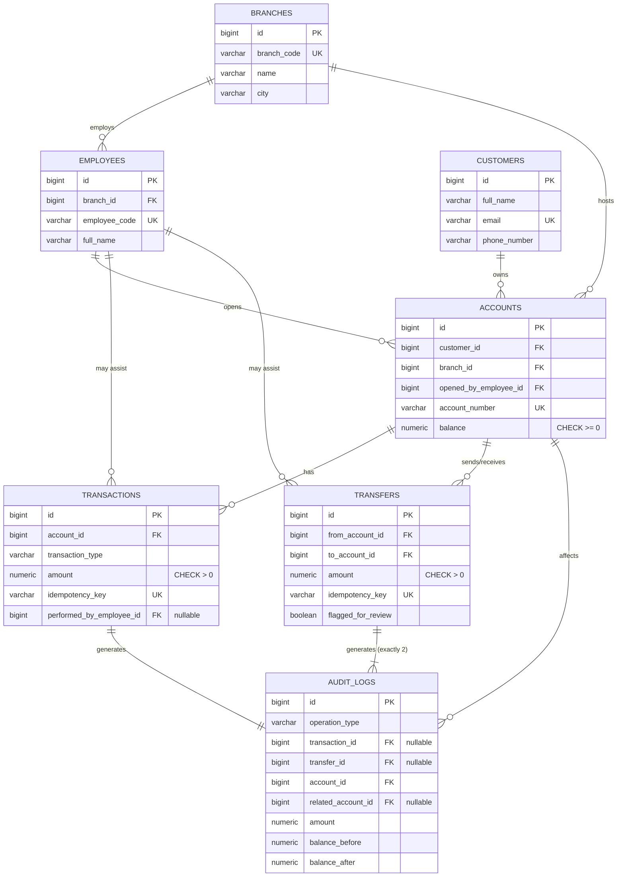
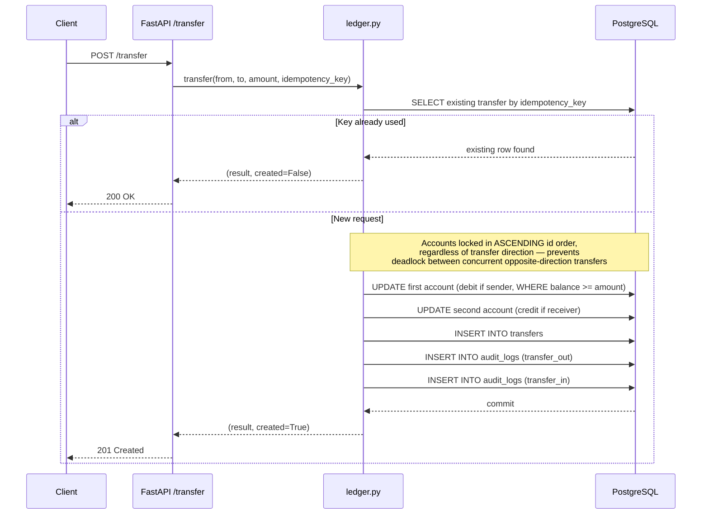
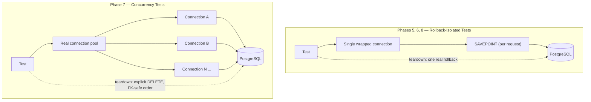
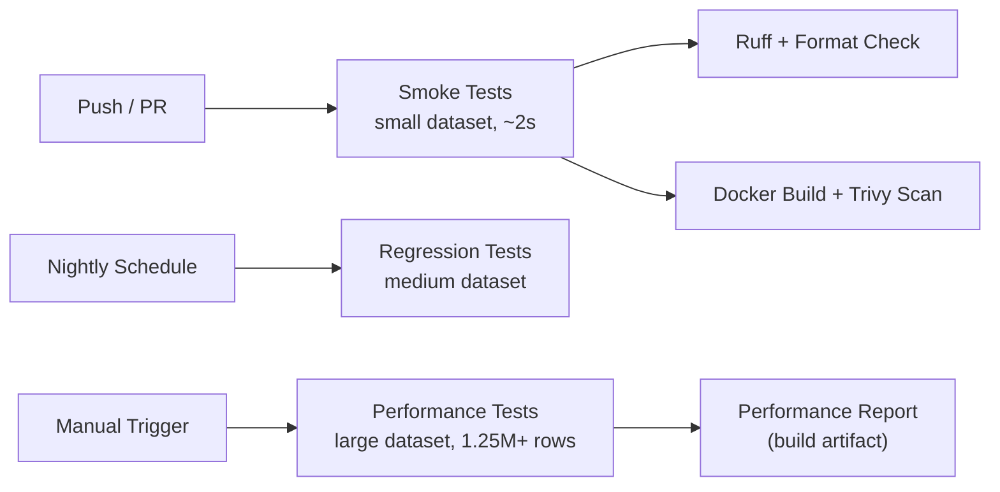

# Architecture & Design Decision

## The core reframe

BankGuard's schema and seed data aren't the product - they're the fixture.

---

## Database ER Diagram

**Why `audit_logs` has two nullable FKs instead of one polymorphic reference:** a single `reference_id` column pointing at either `transactions` or `transfers` depending on context can't have a real foreign key constraint — which directly contradicts the Referential Integrity suite this table is supposed to help prove. Two separate nullable FKs, with a `CHECK` constraint enforcing exactly one is set matching `operation_type`, keeps every reference genuinely enforced.

**Why transfers generate 2 audit rows, not 1:** Balance Reconciliation needs "give me account X's full history" to be a uniform `WHERE account_id = X` query for *every* account. A single row keyed only to the sender would mean the receiving account's balance change never appears in any row keyed to its own `account_id` — reconciliation would silently break for every account that only ever receives transfers.

---

## Transfer Request Flow

**Why the sufficiency check lives inside the `UPDATE`'s `WHERE` clause** (`WHERE balance >= amount`), rather than a separate `SELECT` then `UPDATE`: a read-then-write pattern lets two concurrent requests both read the same balance, both pass the check, and both succeed — leaving the account negative. Making the check part of the `UPDATE` itself means Postgres evaluates it against the current, row-locked value, so concurrent requests against the same account serialize safely at the database level with no additional application-side locking.

---

## Test Isolation Strategy

Two different approaches, used deliberately for different purposes:

Most tests use a single connection wrapped so the application code's own `commit()`/`rollback()` calls operate on a `SAVEPOINT` instead of the real transaction — meaning `ledger.py` can commit as normal, while the test fixture undoes everything with one real rollback at teardown. This keeps the seeded dataset untouched no matter how many tests run.

Concurrency tests can't use this: a single connection can only run one query at a time, so racing "concurrent" requests through it would just serialize them — defeating the entire point. Those tests use the app's real connection pool instead (genuinely separate sessions, genuinely racing the same rows) and clean up their own dedicated test accounts explicitly afterward.

---

## CI/CD Pipeline

Full breakdown in [cicd.md](cicd.md).
